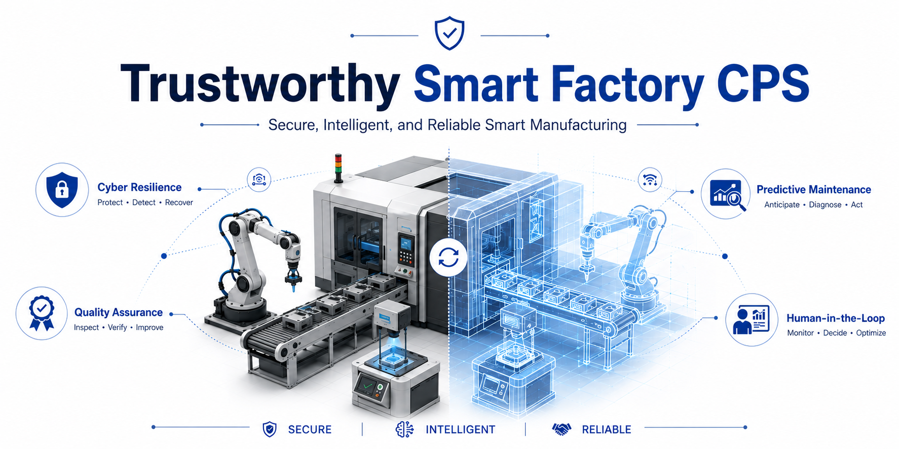
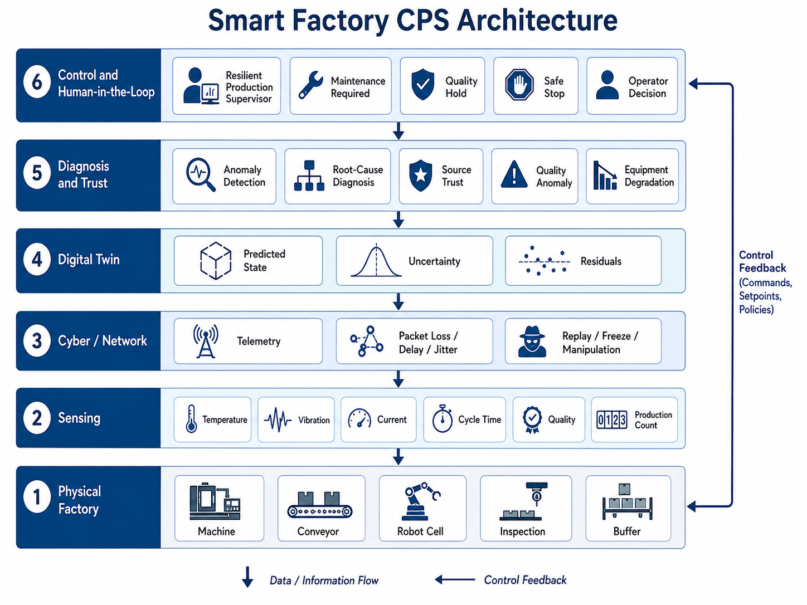

# Trustworthy Smart Factory Cyber-Physical System

<p align="center">
  
</p>

[](https://github.com/Hirakhyzer/trustworthy-smart-factory-cps/actions/workflows/ci.yml)


A reproducible **smart-manufacturing + cybersecurity + CPS** research platform combining a reduced-order factory cell, machine degradation, product-quality modeling, network/telemetry faults, a digital twin with uncertainty, physics-informed anomaly detection, source trust, fault/cyber diagnosis, resilient production supervision, and human-in-the-loop decision concepts.

> **Research boundary:** this repository is simulation-only. It is not an operational PLC/SCADA controller, machine-safety system, or exploit toolkit. All attack/fault modules manipulate only synthetic in-memory telemetry.

## Core research question

**Can a smart-factory CPS distinguish cyberattack, sensor fault, equipment degradation, quality anomaly, network fault, and ordinary model mismatch well enough to preserve production safely and transparently?**

<p align="center">
  
</p>

```text
Factory process -> sensors -> synthetic faults/attacks -> network
       |                                             |
       +------ physical state -----------------------+
                             |
                       Digital Twin
                             |
                  Physics residuals + freshness
                             |
                    Trust + diagnosis engine
                             |
                  Resilient production supervisor
                             |
                    load / hold / maintenance
                             |
                         Factory process
```

## Digital-twin concept

The digital twin provides an interpretable reference for expected machine health, process signals, cycle behavior, and product quality. Detector residuals are normalized by uncertainty so model mismatch can be studied separately from abrupt cyber or fault effects.

<p align="center">
  
</p>

## Implemented in v0.1

- reduced-order production machine with evolving health;
- temperature, vibration, motor-current, cycle-time and quality dynamics;
- conveyor/buffer behavior and inspection pass/fail;
- noisy sensing;
- timestamped/sequence-numbered telemetry;
- packet loss, latency and jitter;
- temperature, vibration, current, quality and production-count manipulation;
- replay and metadata-rewritten replay;
- sensor freeze;
- digital-twin prediction with configurable model mismatch;
- uncertainty-normalized residual detection;
- temporal freshness checks;
- dynamic source trust;
- diagnosis labels for cyberattack, sensor fault, degradation, quality anomaly and model mismatch;
- resilient supervisor states from `NORMAL` to `SAFE_STOP`;
- maintenance/prognostics helpers;
- human-review abstraction;
- standardized scenarios, metrics, plots, tests and CI.

## Quick start

```bash
git clone https://github.com/Hirakhyzer/trustworthy-smart-factory-cps.git
cd trustworthy-smart-factory-cps
python -m venv .venv
source .venv/bin/activate  # Windows: .venv\Scripts\activate
pip install -e ".[dev]"
pytest
python scripts/run_demo.py
python scripts/run_scenarios.py
```

## Research scenarios

| Scenario | Purpose |
|---|---|
| Normal production | false-alarm baseline |
| Accelerated degradation | predictive-maintenance behavior |
| Temperature bias | process-sensor integrity |
| Vibration spoof | condition-monitoring integrity |
| Quality falsification | inspection integrity |
| Replay | temporal integrity |
| Rewritten replay | stealthy temporal attack |
| Sensor freeze | stale telemetry |
| Lossy network | communication resilience |
| Attack during degradation | simultaneous cyber + physical fault |

## Scientific integrity

Default parameters are illustrative and outputs are synthetic. Do not describe results as measurements from a real production line. Publications should record configuration, software commit, random seed, attack window, thresholds, model mismatch, and parameter provenance.

See the `docs/` folder for architecture, threat model, digital twin, diagnosis, predictive maintenance, quality assurance, human-in-the-loop concepts, benchmark protocol, **baseline findings**, reproducibility, references, and roadmap.
