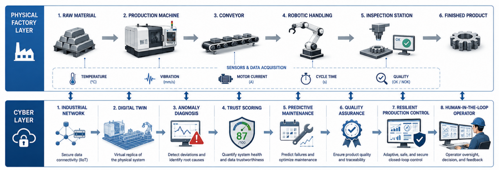

# Digital Twin

The digital twin predicts machine health, temperature, vibration, current, cycle time, and quality from commanded load and a reduced-order degradation model. Detector residuals are normalized by explicit uncertainty scales.

  

Future work should include state estimation, parameter adaptation, uncertainty propagation, and VVUQ.
